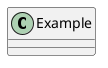

# Markdown language for Jetbrains MPS  

This repository contains a markdown language for MPS the language has an editor and
a generator for generating text files.

The language is based on the specification published at https://www.markdownguide.org/basic-syntax/  

# Used key combinations
CTRL+ALT 1 for Heading level 1  
CTRL+ALT 2 for Heading level 2  
CTRL+ALT 3 for Heading level 3  
CTRL+I for Italic  
CTRL+B for Bold  